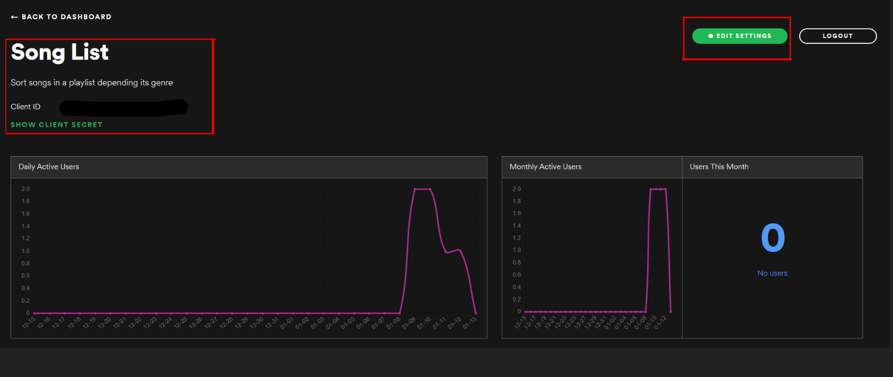
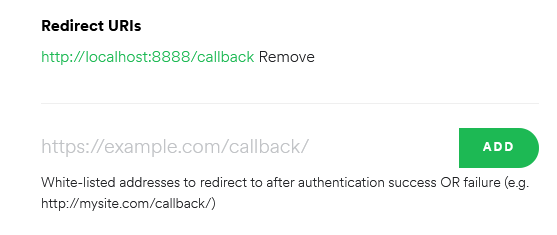
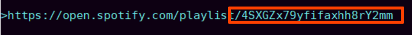

<h1>spotifind</h1>

Download songs from your Spotify playlists and liked songs using youtubedl

 

First of all, you need to create an app in spotify for developers

 https://developer.spotify.com/dashboard/applications
 

once created, you need to copy your Client ID and Client secret

 

and then in the same page, go to settings and change the redirect URI to "http://localhost:8888/callback "

 

Once you have your ID and Secret, go to credentials.py and copy/paste them where asked, and you are good to go, just call main.py

 

To download a playlist, you need its ID, just go to your playlist, go to 'Share' in the 3 dots menu, and copy the link.

The ID is the string of characters after the last dash.

